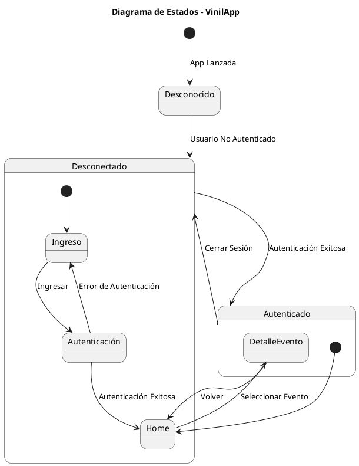
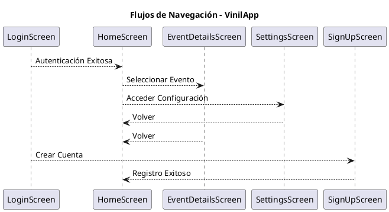

# Documento Técnico de VinilApp
--
### Introducción

## Objetivo del Proyecto

VinilApp es una aplicación móvil desarrollada para los seguidores del grupo musical "Los Vinilos". Su objetivo principal es proporcionar a los fans una experiencia interactiva y enriquecedora, permitiéndoles acceder a contenido exclusivo del grupo y facilitando la solicitud de presupuestos para eventos. La aplicación está diseñada para ser intuitiva y fácil de usar, asegurando una experiencia fluida y atractiva para los usuarios.

## Arquitectura del Proyecto

VinilApp sigue el patrón de arquitectura Model-View-ViewModel (MVVM), que separa la lógica de presentación de la lógica de negocio, facilitando la prueba y el mantenimiento del código.

**Model:** Contiene la lógica de negocio y los datos de la aplicación, incluyendo la manipulación de datos de usuarios y eventos almacenados en Firebase Firestore.

**View:** Es la interfaz de usuario que se muestra a los usuarios. En VinilApp, las vistas son funciones composables que describen cómo debe ser la UI utilizando Jetpack Compose.

**ViewModel:** Actúa como un intermediario entre el Model y la View. Gestiona la lógica de presentación y la manipulación del estado de la UI, utilizando LiveData y StateFlow para observar y reaccionar a los cambios de estado.

**RealTime Database:** Sirve como una capa intermedia que maneja las operaciones de datos entre el Model y ViewModel, garantizando una fuente única de verdad (SSOT) y facilitando la gestión de datos en tiempo real utilizando Firebase.

### Diagrama de Arquitectura MVVM

```plaintext
+----------------+    +----------------+    +----------------+
|                |    |                |    |                |
|     Model      |    |   ViewModel    |    |      View      |
|                |    |                |    |                |
+----------------+    +----------------+    +----------------+
        ^                      ^                      ^
        |                      |                      |
        +----------------------|----------------------+
                               |
                               |
                        +--------------+
                        | RealTime DB  |
                        +--------------+
```

## Componentes Principales

### Firebase

- **Authentication:** Maneja la autenticación de usuarios, permitiendo el inicio de sesión y registro utilizando correo electrónico y Google Sign-In.
- **Realtime Database:** Almacena y sincroniza datos en tiempo real, asegurando que las actualizaciones de contenido y las interacciones de los usuarios se reflejen instantáneamente en la aplicación.
- **Storage:** Almacena archivos multimedia, como imágenes y videos, proporcionando una solución escalable para el manejo de contenido.

### Jetpack Compose

- **UI Declarativa:** Permite la creación de interfaces de usuario de manera declarativa, simplificando el código y mejorando la mantenibilidad.
- **State Management:** Gestiona el estado de la UI de forma reactiva y eficiente, utilizando StateFlow y MutableStateFlow para garantizar que la interfaz de usuario se actualice en respuesta a los cambios en los datos.

### Kotlin

- **Kotlin Multiplatform:** Ofrece la posibilidad de expandir la aplicación a otras plataformas, reutilizando el código y manteniendo la consistencia en diferentes sistemas operativos.

---
### Configuración Inicial

#### Requisitos Previos

Para desarrollar y desplegar VinilApp, necesitarás las siguientes herramientas y entornos:

- **Android Studio:** El entorno de desarrollo integrado (IDE) oficial para el desarrollo de aplicaciones Android.
- **Java Development Kit (JDK):** Recomendado JDK 8 o superior.
- **SDK de Android:** Incluido con Android Studio.
- **Firebase Console:** Para gestionar la autenticación, base de datos y almacenamiento.
- **Cuenta de GitHub:** Para clonar el repositorio del proyecto.


#### Configuración del Proyecto

##### Método Bajando desde GitHub

1. **Acceder al Repositorio:**

   El código fuente de VinilApp está disponible en el siguiente repositorio de GitHub: [VinilApp_release](https://github.com/ptrdck/VinilApp_release/). 

   **Pasos para descargar el proyecto:**
   - Visita el enlace del repositorio.
   - Haz clic en el botón verde "Code" y selecciona "Download ZIP" para descargar el proyecto como un archivo ZIP.
   - Alternativamente, puedes clonar el repositorio utilizando Git. Abre tu terminal y ejecuta el siguiente comando:
     ```bash
     git clone https://github.com/ptrdck/VinilApp_release.git
     ```

2. **Importar el Proyecto en Android Studio:**
   - Abre Android Studio.
   - Selecciona "Open an existing Android Studio project".
   - Navega hasta la ubicación donde descargaste o clonaste el proyecto y selecciónalo.
   - Android Studio sincronizará el proyecto y descargará las dependencias necesarias.

3. **Configurar Android Studio:**
   - Asegúrate de tener las versiones correctas del SDK y las herramientas de compilación instaladas.
   - El proyecto está configurado para utilizar Firebase. Las bases de datos no necesitan inicialización ya que están registradas y configuradas en el proyecto. No se pueden crear nuevas bases de datos debido a las restricciones del producto.

#### Configuración de Firebase

**Configuración del `AndroidManifest.xml`:**

```xml
<manifest xmlns:android="http://schemas.android.com/apk/res/android"
    xmlns:tools="http://schemas.android.com/tools">

    <!-- Añadir permisos a la aplicación -->
    <uses-permission android:name="android.permission.INTERNET" />
    <uses-permission android:name="android.permission.CAMERA" />
    <uses-feature android:name="android.hardware.camera" android:required="true" />
    <uses-permission android:name="android.permission.READ_MEDIA_IMAGES" />
    <uses-permission android:name="android.permission.READ_MEDIA_VIDEO" />
    <uses-permission android:name="android.permission.READ_MEDIA_AUDIO" />
    <uses-permission android:name="android.permission.READ_EXTERNAL_STORAGE" android:maxSdkVersion="33" />
    <uses-permission android:name="android.permission.WRITE_EXTERNAL_STORAGE" android:maxSdkVersion="33" />
    <uses-permission android:name="android.permission.ACCESS_NETWORK_STATE" />
    <uses-permission android:name="android.permission.ACCESS_FINE_LOCATION"/>
    <uses-permission android:name="android.permission.ACCESS_COARSE_LOCATION"/>

    <application
        android:name=".VinylApp"
        android:requestLegacyExternalStorage="true"
        android:allowBackup="true"
        android:dataExtractionRules="@xml/data_extraction_rules"
        android:fullBackupContent="@xml/backup_rules"
        android:icon="@mipmap/ic_vinilapp"
        android:label="@string/app_name"
        android:roundIcon="@mipmap/ic_vinilapp_round"
        android:supportsRtl="true"
        android:theme="@style/Theme.VinilaApp_v3"
        tools:targetApi="31">

        <activity
            android:name=".MainActivity"
            android:exported="true"
            android:label="@string/app_name"
            android:theme="@style/Theme.VinilaApp_v3">
            <intent-filter>
                <action android:name="android.intent.action.MAIN" />
                <category android:name="android.intent.category.LAUNCHER" />
            </intent-filter>
        </activity>
        <activity android:name=".HomeActivity" />

        <provider
            android:name="androidx.core.content.FileProvider"
            android:authorities="${applicationId}.fileprovider"
            android:exported="false"
            android:grantUriPermissions="true">
            <meta-data
                android:name="android.support.FILE_PROVIDER_PATHS"
                android:resource="@xml/file_paths" />
        </provider>

        <meta-data
            android:name="com.google.android.geo.API_KEY"
            android:value="@string/g_maps_id"/>
    </application>

</manifest>
```

**Configuración del `build.gradle`:**

```gradle
plugins {
    alias(libs.plugins.android.application)
    alias(libs.plugins.jetbrains.kotlin.android)
    id("com.google.gms.google-services")
}

android {
    namespace = "es.dam.pi.vinilaapp_v3"
    compileSdk = 34

    defaultConfig {
        applicationId = "es.dam.pi.vinilaapp_v3"
        minSdk = 28
        targetSdk = 34
        versionCode = 1
        versionName = "1.0"

        testInstrumentationRunner = "androidx.test.runner.AndroidJUnitRunner"
        vectorDrawables {
            useSupportLibrary = true
        }
    }

    buildTypes {
        release {
            isMinifyEnabled = false
            proguardFiles(
                getDefaultProguardFile("proguard-android-optimize.txt"),
                "proguard-rules.pro"
            )
        }
    }
    compileOptions {
        sourceCompatibility = JavaVersion.VERSION_1_8
        targetCompatibility = JavaVersion.VERSION_1_8
    }
    kotlinOptions {
        jvmTarget = "1.8"
    }
    buildFeatures {
        compose = true
    }
    composeOptions {
        kotlinCompilerExtensionVersion = "1.5.1"
    }
    packaging {
        resources {
            excludes += "/META-INF/{AL2.0,LGPL2.1}"
        }
    }
    packagingOptions {
        resources.excludes.add("META-INF/androidx.compose.material3_material3.version")
    }
}

dependencies {
    implementation(libs.android.mail)
    implementation(libs.android.activation)
    implementation(libs.gson)
    implementation(libs.androidx.material.icons.core)
    implementation(libs.androidx.material.icons.extended)
    implementation(libs.accompanist.swiperefresh)
    implementation(libs.core)
    implementation(libs.okhttp)
    implementation(libs.logging.interceptor.v493)
    implementation(platform(libs.firebase.bom))
    implementation(libs.firebase.auth.ktx)
    implementation(libs.firebase.firestore.ktx)
    implementation(libs.firebase.database)
    implementation(libs.firebase.storage.ktx)
    implementation(libs.play.services.auth)
    implementation(libs.play.services.auth.api.phone)
    implementation(libs.play.services.identity)
    implementation(libs.maps.compose)
    implementation(libs.play.services.maps)
    implementation(libs.play.services.location)
    implementation(libs.places)
    implementation(libs.kotlinx.coroutines.android)
    implementation(libs.retrofit)
    implementation(libs.converter.gson)
    implementation(libs.accompanist.pager)
    implementation(libs.accompanist.pager.indicators)
    implementation(libs.glide)
    implementation(libs.firebase.crashlytics.buildtools)
    annotationProcessor(libs.compiler)
    implementation(libs.compose)
    implementation(platform(libs.androidx.compose.bom))
    implementation(libs.androidx.ui)
    implementation(libs.androidx.ui.graphics)
    implementation(libs.androidx.ui.tooling.preview)
    implementation(libs.androidx.material3)
    implementation(libs.androidx.lifecycle.viewmodel)
    implementation(libs.androidx.lifecycle.runtime.ktx)
    implementation(libs.androidx.lifecycle.viewmodel.compose)
    implementation(libs.androidx.lifecycle.viewmodel.ktx)
    implementation(libs.lifecycle.livedata.ktx)
    implementation(libs.androidx.navigation.compose)
    implementation(libs.androidx.core.ktx)
    implementation(libs.androidx.activity.compose)
    testImplementation(libs.junit)
    androidTestImplementation(libs.androidx.junit)
    androidTestImplementation(libs.androidx.espresso.core)
    androidTestImplementation(libs.androidx.ui.test.junit4)
    debugImplementation(libs.androidx.ui.tooling)
    debugImplementation(libs.androidx.ui.test.manifest)
}
```

### Instalación en Dispositivos Móviles

#### Instalar desde Android Studio

1. Conecta tu dispositivo móvil a tu computadora mediante un cable USB.
2. Asegúrate de que la depuración USB esté habilitada en tu dispositivo.
3. En Android Studio, selecciona tu dispositivo desde el menú de dispositivos disponibles.
4. Haz clic en el botón "Run" (icono de play) para compilar y ejecutar la aplicación directamente en tu dispositivo.

#### Generar APK Firmada

1. En Android Studio, selecciona "Build" en el menú superior.
2. Selecciona "Generate Signed Bundle/APK".
3. Sigue las instrucciones para crear una clave de firma y generar el APK firmado.
4. Una vez generado, transfiere el APK a tu dispositivo móvil y sigue las instrucciones para instalarlo.

#### Instalación Alternativa mediante Google Drive

1. Accede a la siguiente URL: [Google Drive Folder](https://drive.google.com/drive/u/0/folders/109XOwEhSyUU5fhV-Y2lco5kB8iptoPfS).
2. Solicita permisos para acceder al contenido.
3. Descarga el APK desde Google Drive.
4. En tu dispositivo móvil, habilita la instalación de aplicaciones desde fuentes desconocidas en la configuración de seguridad.
5. Abre el APK descargado y sigue las instrucciones para instalar la aplicación.

---
### 3. Estructura del Proyecto

#### Estructura de Directorios

La estructura de directorios de VinilApp está organizada para seguir las mejores prácticas de desarrollo de aplicaciones Android utilizando el patrón de arquitectura MVVM (Model-View-ViewModel). A continuación se describe la estructura de carpetas y archivos del proyecto:

```
VinilApp/
├── app/
│   ├── build/
│   ├── libs/
│   ├── src/
│   │   ├── main/
│   │   │   ├── java/
│   │   │   │   └── es/
│   │   │   │       └── dam/
│   │   │   │           └── pi/
│   │   │   │               └── vinilaapp_v3/
│   │   │   │                   ├── data/
│   │   │   │                   │   ├── model/
│   │   │   │                   │   ├── repository/
│   │   │   │                   │   └── source/
│   │   │   │                   ├── ui/
│   │   │   │                   │   ├── screen/
│   │   │   │                   │   ├── viewmodel/
│   │   │   │                   │   └── component/
│   │   │   │                   ├── utils/
│   │   │   │                   └── VinylApp.kt
│   │   │   ├── res/
│   │   │   │   ├── drawable/
│   │   │   │   ├── layout/
│   │   │   │   ├── values/
│   │   │   │   └── xml/
│   │   │   ├── AndroidManifest.xml
│   │   └── test/
│   │       └── java/
│   │           └── es/
│   │               └── dam/
│   │                   └── pi/
│   │                       └── vinilaapp_v3/
│   ├── build.gradle
│   └── proguard-rules.pro
├── build.gradle
├── settings.gradle
└── README.md
```

#### Descripción de Componentes

**1. `VinylApp.kt`:**

Archivo principal de la aplicación que inicializa los componentes globales. Contiene la configuración inicial de Firebase y la inyección de dependencias.

**2. `data/`:**

Contiene todas las clases relacionadas con la manipulación de datos, incluyendo modelos, repositorios y fuentes de datos.

- **`model/`**: Contiene las definiciones de los modelos de datos utilizados en la aplicación.
    - **`User.kt`**: Modelo de datos para el usuario.
    - **`Event.kt`**: Modelo de datos para los eventos.

- **`repository/`**: Contiene los repositorios que gestionan la comunicación entre el ViewModel y las fuentes de datos.
    - **`UserRepository.kt`**: Repositorio para la gestión de datos de usuarios.
    - **`EventRepository.kt`**: Repositorio para la gestión de datos de eventos.

- **`source/`**: Contiene las fuentes de datos específicas (local y remota).
    - **`LocalDataSource.kt`**: Fuente de datos local.
    - **`RemoteDataSource.kt`**: Fuente de datos remota, que interactúa con Firebase.

**3. `ui/`:**

Contiene todas las clases relacionadas con la interfaz de usuario, incluyendo pantallas, viewmodels y componentes UI.

- **`screen/`**: Contiene las composables que definen las pantallas de la aplicación.
    - **`LoginScreen.kt`**: Pantalla de inicio de sesión.
    - **`HomeScreen.kt`**: Pantalla principal después de la autenticación.

- **`viewmodel/`**: Contiene las clases ViewModel que gestionan la lógica de presentación.
    - **`LoginViewModel.kt`**: ViewModel para la pantalla de inicio de sesión.
    - **`HomeViewModel.kt`**: ViewModel para la pantalla principal.

- **`component/`**: Contiene componentes UI reutilizables.
    - **`CustomButton.kt`**: Botón personalizado utilizado en varias pantallas.

**4. `utils/`:**

Contiene utilidades y clases helper que se utilizan en diferentes partes de la aplicación.

**5. `res/`:**

Contiene los recursos de la aplicación como imágenes, layouts, valores y configuraciones XML.

- **`drawable/`**: Imágenes y gráficos utilizados en la aplicación.
- **`layout/`**: Archivos de diseño XML (aunque en Jetpack Compose se usa menos).
- **`values/`**: Archivos de valores como strings, colors, y styles.
- **`xml/`**: Configuraciones XML como `backup_rules.xml` y `file_paths.xml`.

**6. `AndroidManifest.xml`:**

Archivo de manifiesto de Android que define los componentes de la aplicación, permisos y meta-datos necesarios para su funcionamiento.

**7. `build.gradle` y `settings.gradle`:**

Archivos de configuración de Gradle que manejan las dependencias y la configuración de compilación del proyecto.

---


5. ### Pantallas Principales

#### MainActivity

**Descripción de la Pantalla:**
La `MainActivity` actúa como la pantalla de inicio de sesión de VinilApp. Permite a los usuarios autenticarse utilizando su correo electrónico y contraseña, o mediante Google Sign-In. Además, proporciona opciones para registrarse y recuperar la contraseña. Esta pantalla es crucial para garantizar que solo usuarios autorizados puedan acceder a las funcionalidades principales de la aplicación.

**Funcionalidades de la Pantalla:**
1. **Inicio de Sesión con Correo y Contraseña:** Los usuarios pueden ingresar su correo electrónico y contraseña para autenticarse.
2. **Inicio de Sesión con Google:** Los usuarios pueden utilizar su cuenta de Google para iniciar sesión en la aplicación.
3. **Registro de Nuevos Usuarios:** La pantalla ofrece una opción para navegar a la pantalla de registro donde los nuevos usuarios pueden crear una cuenta.
4. **Recuperación de Contraseña:** Los usuarios pueden acceder a una funcionalidad para recuperar su contraseña en caso de olvido.

**Componentes Principales:**
- **Campos de Entrada de Texto:** Campos para ingresar el correo electrónico y la contraseña.
- **Botón de Inicio de Sesión:** Botón que permite iniciar sesión una vez que se ingresan las credenciales.
- **Opción de Registro:** Enlace para navegar a la pantalla de registro.
- **Opción de Recuperación de Contraseña:** Enlace para iniciar el proceso de recuperación de contraseña.
- **Botón de Inicio de Sesión con Google:** Botón para iniciar sesión utilizando Google Sign-In.

**ViewModel Correspondiente:**
El `LoginViewModel` gestiona la lógica de negocio de la `MainActivity`. Este ViewModel se encarga de:
- Validar las credenciales de inicio de sesión.
- Manejar la autenticación con Firebase Authentication.
- Gestionar el inicio de sesión con Google.
- Monitorear el estado de inicio de sesión y actualizar la UI en consecuencia.

**Models Utilizados:**
- **UserData:** Modelo que representa los datos del usuario autenticado.
- **SignInResult:** Modelo que encapsula los resultados del intento de inicio de sesión, incluyendo los posibles errores.

**Capturas de Pantalla:**


---

#### LoginScreen

**Descripción de la Pantalla:**
La `LoginScreen` es una pantalla específica dentro de `MainActivity` que permite a los usuarios iniciar sesión utilizando su correo electrónico y contraseña, o mediante Google Sign-In. Además, proporciona opciones para registrarse y recuperar la contraseña.

**Funcionalidades de la Pantalla:**
1. **Inicio de Sesión con Correo y Contraseña:** Los usuarios pueden ingresar su correo electrónico y contraseña para autenticarse.
2. **Inicio de Sesión con Google:** Los usuarios pueden utilizar su cuenta de Google para iniciar sesión en la aplicación.
3. **Registro de Nuevos Usuarios:** La pantalla ofrece una opción para navegar a la pantalla de registro donde los nuevos usuarios pueden crear una cuenta.
4. **Recuperación de Contraseña:** Los usuarios pueden acceder a una funcionalidad para recuperar su contraseña en caso de olvido.

**Componentes Principales:**
- **Campos de Entrada de Texto:** Campos para ingresar el correo electrónico y la contraseña.
- **Botón de Inicio de Sesión:** Botón que permite iniciar sesión una vez que se ingresan las credenciales.
- **Opción de Registro:** Enlace para navegar a la pantalla de registro.
- **Opción de Recuperación de Contraseña:** Enlace para iniciar el proceso de recuperación de contraseña.
- **Botón de Inicio de Sesión con Google:** Botón para iniciar sesión utilizando Google Sign-In.

**ViewModel Correspondiente:**
El `LoginViewModel` gestiona la lógica de negocio de la `LoginScreen`. Este ViewModel se encarga de:
- Validar las credenciales de inicio de sesión.
- Manejar la autenticación con Firebase Authentication.
- Gestionar el inicio de sesión con Google.
- Monitorear el estado de inicio de sesión y actualizar la UI en consecuencia.

**Models Utilizados:**
- **UserData:** Modelo que representa los datos del usuario autenticado.
- **SignInResult:** Modelo que encapsula los resultados del intento de inicio de sesión, incluyendo los posibles errores.

**Capturas de Pantalla:**


---

#### SignInScreen

**Descripción de la Pantalla:**
La `SignInScreen` permite a los nuevos usuarios registrarse en la aplicación. Los usuarios pueden ingresar su correo electrónico, una contraseña y confirmar la contraseña para crear una nueva cuenta.

**Funcionalidades de la Pantalla:**
1. **Registro de Nuevos Usuarios:** Los usuarios pueden ingresar su correo electrónico, una contraseña y confirmar la contraseña para crear una nueva cuenta.
2. **Validación de Contraseñas:** La pantalla verifica que la contraseña y la confirmación de la contraseña coincidan.
3. **Navegación a la Pantalla de Inicio:** Una vez registrado con éxito, el usuario es redirigido a la pantalla principal de la aplicación.

**Componentes Principales:**
- **Campos de Entrada de Texto:** Campos para ingresar el correo electrónico, la contraseña y confirmar la contraseña.
- **Botón de Registro:** Botón que permite crear una cuenta una vez que se ingresan y validan las credenciales.

**ViewModel Correspondiente:**
El `LoginViewModel` gestiona la lógica de negocio de la `SignInScreen`. Este ViewModel se encarga de:
- Validar las credenciales de registro.
- Manejar la creación de nuevas cuentas de usuario con Firebase Authentication.
- Monitorear el estado de registro y actualizar la UI en consecuencia.

**Models Utilizados:**
- **UserData:** Modelo que representa los datos del usuario autenticado.
- **SignInResult:** Modelo que encapsula los resultados del intento de registro, incluyendo los posibles errores.

**Capturas de Pantalla:**


---

### Resumen

La `MainActivity` y sus pantallas asociadas (`LoginScreen` y `SignInScreen`) son fundamentales para gestionar la autenticación de usuarios en VinilApp. Estas pantallas permiten a los usuarios iniciar sesión, registrarse y recuperar sus contraseñas, utilizando tanto el correo electrónico y la contraseña como la autenticación de Google. La lógica de autenticación y la gestión del estado de la UI se manejan a través del `LoginViewModel`, asegurando una experiencia de usuario fluida y segura. A continuación, se presentan las capturas de pantalla para ilustrar el diseño y la funcionalidad de cada pantalla.

### 5. Componentes Reutilizables

#### Descripción de Componentes Comunes

1. **Botones**
    - **Botón de Inicio de Sesión**
    - **Botón de Registro**
    - **Botón de Enviar Contrato**
    - **Botón de Google Login**
    - **Botón de Recuperar Contraseña**
  
2. **Diálogos**
    - **Diálogo de Confirmación de Envío**
    - **Diálogo de Éxito**
    - **Diálogo de Imagen Expandida**

#### Código de los Componentes

**Botón de Inicio de Sesión**

```kotlin
@Composable
fun LoginButton(loginEnable: Boolean, onLoginSelected: () -> Unit) {
    Button(
        onClick = { onLoginSelected() },
        modifier = Modifier
            .fillMaxWidth()
            .height(48.dp)
            .padding(8.dp),
        colors = ButtonDefaults.buttonColors(
            containerColor = if (loginEnable) MaterialTheme.colorScheme.primary else Color.Gray,
            contentColor = MaterialTheme.colorScheme.onPrimary,
            disabledContentColor = Color.LightGray
        ),
        enabled = loginEnable
    ) {
        Text(text = "Iniciar Sesión", fontSize = 16.sp, fontWeight = FontWeight.Bold)
    }
}
```

**Botón de Registro**

```kotlin
@Composable
fun SignInButton(loginEnable: Boolean, onLoginSelected: () -> Unit) {
    Button(
        onClick = { onLoginSelected() },
        modifier = Modifier
            .fillMaxWidth()
            .height(48.dp),
        colors = ButtonDefaults.buttonColors(
            containerColor = if (loginEnable) MaterialTheme.colorScheme.primary else Color.Gray,
            contentColor = MaterialTheme.colorScheme.onPrimary,
            disabledContentColor = Color.LightGray
        ),
        enabled = loginEnable
    ) {
        Text(text = "Crear cuenta", fontSize = 16.sp, fontWeight = FontWeight.Bold)
    }
}
```

**Botón de Enviar Contrato**

```kotlin
@Composable
fun ButtonSection(onSendClick: () -> Unit, onClearClick: () -> Unit, onCancelClick: () -> Unit) {
    Column(
        horizontalAlignment = Alignment.CenterHorizontally,
        modifier = Modifier.fillMaxWidth()
    ) {
        Row(
            horizontalArrangement = Arrangement.SpaceEvenly,
            verticalAlignment = Alignment.CenterVertically,
            modifier = Modifier.fillMaxWidth()
        ) {
            Column(horizontalAlignment = Alignment.CenterHorizontally) {
                IconButton(onClick = onSendClick, modifier = Modifier.size(48.dp)) {
                    Icon(imageVector = Icons.AutoMirrored.Filled.Send, contentDescription = "Enviar", tint = Color.Green)
                }
                Text(text = "enviar", color = Color.Green, fontSize = 12.sp)
            }
            Column(horizontalAlignment = Alignment.CenterHorizontally) {
                IconButton(onClick = onClearClick, modifier = Modifier.size(48.dp)) {
                    Icon(imageVector = Icons.Default.Delete, contentDescription = "Limpiar", tint = Color.Red)
                }
                Text(text = "limpiar", color = Color.Red, fontSize = 12.sp)
            }
            Column(horizontalAlignment = Alignment.CenterHorizontally) {
                IconButton(onClick = onCancelClick, modifier = Modifier.size(48.dp)) {
                    Icon(imageVector = Icons.Default.Cancel, contentDescription = "Cancelar", tint = Color.Gray)
                }
                Text(text = "cancelar", color = Color.Gray, fontSize = 12.sp)
            }
        }
    }
}
```

**Botón de Google Login**

```kotlin
@Composable
fun GoogleLoginOption(viewModel: LoginViewModel, googleSignInLauncher: ManagedActivityResultLauncher<Intent, ActivityResult>) {
    val context = LocalContext.current
    val email = viewModel.email.value ?: ""
    val userName = email.substringBefore("@")

    Box(modifier = Modifier.fillMaxWidth()) {
        Row(
            modifier = Modifier
                .align(Alignment.Center)
                .height(48.dp)
                .clickable {
                    viewModel.signInWithGoogle({ intent ->
                        googleSignInLauncher.launch(intent)
                    }, {
                        showToast(context, "Error al iniciar sesión con Google")
                    })
                }
                .padding(4.dp),
            verticalAlignment = Alignment.CenterVertically
        ) {
            Image(
                painter = painterResource(id = R.drawable.google),
                contentDescription = "Google Icon",
                modifier = Modifier.size(20.dp)
            )
            Spacer(modifier = Modifier.width(8.dp))
            Text(text = "Inicia sesión con Google", fontSize = 14.sp)
        }
    }
}
```

**Botón de Recuperar Contraseña**

```kotlin
@Composable
fun ForgotPassword() {
    Box(
        modifier = Modifier.fillMaxWidth()
    ) {
        Text(
            text = "Olvidaste tu contraseña?",
            modifier = Modifier
                .clickable { /* Acción de recuperación de contraseña */ }
                .align(Alignment.Center)
                .padding(4.dp),
            fontSize = 12.sp,
            fontWeight = FontWeight.Bold,
            color = Color(0xFF3366BB) // Un color azul distintivo
        )
    }
}
```

**Diálogo de Confirmación de Envío**

```kotlin
@Composable
fun ConfirmationDialog(contract: Contract, onConfirm: () -> Unit, onDismiss: () -> Unit) {
    AlertDialog(
        onDismissRequest = onDismiss,
        confirmButton = {
            TextButton(onClick = onConfirm) {
                Text("Confirmar")
            }
        },
        dismissButton = {
            TextButton(onClick = onDismiss) {
                Text("Cancelar")
            }
        },
        title = { Text("Confirmar Envío") },
        text = {
            Text(
                "Nombre: ${contract.name}\n" +
                        "Correo: ${contract.email}\n" +
                        "Teléfono: ${contract.phone}\n" +
                        "Tipo de concierto: ${contract.concertType}\n" +
                        "Duración: ${contract.duration}\n" +
                        "Fecha del concierto: ${contract.concertDate}\n" +
                        "Dirección: ${contract.address}\n" +
                        "Descripción: ${contract.description}"
            )
        }
    )
}
```

**Diálogo de Éxito**

```kotlin
@Composable
fun SuccessDialog(message: String, onDismiss: () -> Unit) {
    AlertDialog(
        onDismissRequest = onDismiss,
        confirmButton = {
            TextButton(onClick = onDismiss) {
                Text("Aceptar")
            }
        },
        title = { Text("Envío Exitoso") },
        text = { Text(message) }
    )
}
```

**Diálogo de Imagen Expandida**

```kotlin
@OptIn(ExperimentalGlideComposeApi::class)
@Composable
fun ImageDialog(imageUrl: String?, onDismiss: () -> Unit) {
    Dialog(onDismissRequest = onDismiss) {
        Box(
            contentAlignment = Alignment.Center,
            modifier = Modifier
                .fillMaxSize()
                .background(Color.Black.copy(alpha = 0.8f))
        ) {
            GlideImage(
                model = imageUrl,
                contentDescription = null,
                modifier = Modifier
                    .fillMaxWidth()
                    .fillMaxHeight(0.75f)
                    .clip(MaterialTheme.shapes.medium)
                    .clickable(onClick = onDismiss)
            )
        }
    }
}
```

Esta estructura proporciona una descripción detallada de los componentes comunes y su implementación reutilizable en la aplicación.


---

### 6. Integraciones Externas

#### Firebase Authentication

**Descripción:**
Firebase Authentication proporciona servicios de autenticación backend fáciles de usar que se integran con las aplicaciones móviles. En VinilApp, se utiliza para autenticar a los usuarios mediante correo electrónico y contraseña, así como con Google Sign-In.

**Implementación:**

**Configuración:**
1. **Añadir Firebase Authentication al proyecto:**
   ```gradle
   implementation 'com.google.firebase:firebase-auth-ktx'
   ```

2. **Configurar Firebase en `AndroidManifest.xml`:**
   ```xml
   <meta-data
       android:name="com.google.firebase.auth.api_key"
       android:value="@string/g_maps_id"/>
   ```

3. **Inicialización en `VinylApp.kt`:**
   ```kotlin
   class VinylApp : Application() {
       override fun onCreate() {
           super.onCreate()
           FirebaseApp.initializeApp(this)
       }
   }
   ```

**Uso:**

**LoginViewModel:**
```kotlin
class LoginViewModel(
    private val googleAuthUiClient: GoogleAuthUiClient,
    private val userViewModel: UserViewModel
) : ViewModel() {

    private val auth: FirebaseAuth = Firebase.auth

    fun signInWithEmailAndPassword(email: String, password: String, context: Context) = viewModelScope.launch {
        try {
            auth.signInWithEmailAndPassword(email, password).addOnCompleteListener { task ->
                if (task.isSuccessful) {
                    val user = auth.currentUser
                    if (user != null) {
                        if (user.isEmailVerified) {
                            userViewModel.loadUser(user.uid, user)
                        } else {
                            Toast.makeText(context, "Por favor, verifica tu correo electrónico.", Toast.LENGTH_LONG).show()
                            auth.signOut()
                        }
                    } else {
                        Toast.makeText(context, "Error al iniciar sesión: Usuario no encontrado", Toast.LENGTH_SHORT).show()
                    }
                } else {
                    Toast.makeText(context, "Error al iniciar sesión: ${task.exception?.message}", Toast.LENGTH_SHORT).show()
                }
            }
        } catch (ex: Exception) {
            Toast.makeText(context, "Error al iniciar sesión: ${ex.message}", Toast.LENGTH_SHORT).show()
        }
    }
}
```

#### Firebase Realtime Database

**Descripción:**
Firebase Realtime Database permite almacenar y sincronizar datos entre usuarios en tiempo real. En VinilApp, se utiliza para almacenar información de los eventos y las interacciones de los usuarios.

**Configuración:**

1. **Añadir Firebase Realtime Database al proyecto:**
   ```gradle
   implementation 'com.google.firebase:firebase-database-ktx'
   ```

2. **Inicialización en `VinylApp.kt`:**
   ```kotlin
   class VinylApp : Application() {
       override fun onCreate() {
           super.onCreate()
           FirebaseApp.initializeApp(this)
       }
   }
   ```

**Uso:**

**EventRepository:**
```kotlin
class EventRepository {
    private val database = FirebaseDatabase.getInstance()
    private val eventRef = database.getReference("events")

    fun getEvents(): Flow<List<Event>> = callbackFlow {
        val listener = object : ValueEventListener {
            override fun onDataChange(snapshot: DataSnapshot) {
                val events = snapshot.children.map { it.getValue(Event::class.java)!! }
                trySend(events)
            }

            override fun onCancelled(error: DatabaseError) {
                close(error.toException())
            }
        }
        eventRef.addValueEventListener(listener)
        awaitClose { eventRef.removeEventListener(listener) }
    }
}
```

#### Firebase Cloud Storage

**Descripción:**
Firebase Cloud Storage proporciona una solución escalable para almacenar archivos, incluyendo imágenes y videos. En VinilApp, se utiliza para almacenar archivos multimedia subidos por los usuarios.

**Configuración:**

1. **Añadir Firebase Cloud Storage al proyecto:**
   ```gradle
   implementation 'com.google.firebase:firebase-storage-ktx'
   ```

2. **Inicialización en `VinylApp.kt`:**
   ```kotlin
   class VinylApp : Application() {
       override fun onCreate() {
           super.onCreate()
           FirebaseApp.initializeApp(this)
       }
   }
   ```

**Uso:**

**StorageRepository:**
```kotlin
class StorageRepository {
    private val storage = FirebaseStorage.getInstance()
    private val storageRef = storage.reference

    fun uploadFile(fileUri: Uri, onComplete: (Uri?) -> Unit) {
        val fileRef = storageRef.child("uploads/${fileUri.lastPathSegment}")
        fileRef.putFile(fileUri).addOnSuccessListener {
            fileRef.downloadUrl.addOnSuccessListener { uri ->
                onComplete(uri)
            }
        }.addOnFailureListener {
            onComplete(null)
        }
    }
}
```

#### Google Maps

**Descripción:**
Google Maps se utiliza para mostrar ubicaciones en la aplicación, proporcionando una integración fluida con los servicios de Google para mostrar mapas y ubicaciones.

**Configuración:**

1. **Añadir Google Maps al proyecto:**
   ```gradle
   implementation 'com.google.android.gms:play-services-maps'
   ```

2. **Configuración en `AndroidManifest.xml`:**
   ```xml
   <meta-data
       android:name="com.google.android.geo.API_KEY"
       android:value="@string/google_maps_key"/>
   ```

**Uso:**

**MapScreen:**
```kotlin
@Composable
fun MapScreen() {
    val mapView = rememberMapViewWithLifecycle()
    AndroidView({ mapView }) { mapView ->
        mapView.getMapAsync { googleMap ->
            val location = LatLng(-34.0, 151.0)
            googleMap.addMarker(MarkerOptions().position(location).title("Marker in Sydney"))
            googleMap.moveCamera(CameraUpdateFactory.newLatLng(location))
        }
    }
}
```

#### Visor de YouTube

**Descripción:**
El visor de YouTube se integra para mostrar videos directamente en la aplicación, utilizando el API de YouTube.

**Configuración:**

1. **Añadir YouTube Android Player API al proyecto:**
   ```gradle
   implementation 'com.google.android.youtube:youtube-android-player-api'
   ```

**Uso:**

**YouTubePlayerScreen:**
```kotlin
@Composable
fun YouTubePlayerScreen(videoId: String) {
    val context = LocalContext.current
    AndroidView(factory = {
        YouTubePlayerView(context).apply {
            initialize(context.getString(R.string.youtube_api_key), object : YouTubePlayer.OnInitializedListener {
                override fun onInitializationSuccess(provider: YouTubePlayer.Provider, youTubePlayer: YouTubePlayer, wasRestored: Boolean) {
                    if (!wasRestored) {
                        youTubePlayer.cueVideo(videoId)
                    }
                }

                override fun onInitializationFailure(provider: YouTubePlayer.Provider, errorReason: YouTubeInitializationResult) {
                    Toast.makeText(context, "Error initializing YouTube player", Toast.LENGTH_SHORT).show()
                }
            })
        }
    })
}
```

#### Glide

**Descripción:**
Glide es una biblioteca de carga de imágenes eficiente para Android que se utiliza para cargar y mostrar imágenes en la aplicación.

**Configuración:**

1. **Añadir Glide al proyecto:**
   ```gradle
   implementation 'com.github.bumptech.glide:glide:4.12.0'
   annotationProcessor 'com.github.bumptech.glide:compiler:4.12.0'
   ```

**Uso:**

**ImageLoader:**
```kotlin
@Composable
fun LoadImage(imageUrl: String) {
    AndroidView(
        factory = { context ->
            ImageView(context).apply {
                Glide.with(context).load(imageUrl).into(this)
            }
        },
        modifier = Modifier
            .fillMaxWidth()
            .height(200.dp)
    )
}
```

---

Estas integraciones aseguran que VinilApp pueda utilizar servicios avanzados como autenticación, almacenamiento en la nube, bases de datos en tiempo real, mapas y reproducción de videos de YouTube, mejorando significativamente la funcionalidad y la experiencia del usuario.


---
### 7. Gestión de Estados en Jetpack Compose

#### Descripción del Manejo de Estados

En VinilApp, la gestión de estados se realiza principalmente utilizando las capacidades de Jetpack Compose y las arquitecturas recomendadas como MVVM (Model-View-ViewModel). En este contexto, los estados de la UI se gestionan a través de `State`, `LiveData`, `StateFlow`, y `MutableStateFlow` en los ViewModels.

Jetpack Compose permite una gestión de estados reactiva y declarativa, donde los cambios en el estado desencadenan automáticamente la recomposición de la UI. Esto facilita la creación de interfaces de usuario dinámicas y coherentes, que se actualizan en respuesta a los cambios en los datos subyacentes.

**Componentes principales utilizados para la gestión de estados:**
- **remember**: Un ayudante composable que guarda el estado a través de recomposiciones.
- **mutableStateOf**: Crea un estado mutable observable por Compose.
- **LiveData**: Observado por Composables usando `observeAsState`.
- **StateFlow**: Una API de flujo de estados basada en coroutines para gestionar estados en los ViewModels.

#### Ejemplos de Código

**1. Uso de `remember` y `mutableStateOf`**

En la `LoginScreen`, se utilizan `remember` y `mutableStateOf` para mantener y gestionar el estado de los campos de entrada:

```kotlin
@Composable
fun LoginScreen(viewModel: LoginViewModel, navController: NavController) {
    var email by remember { mutableStateOf("") }
    var password by remember { mutableStateOf("") }

    // ... otros componentes de UI

    TextField(
        value = email,
        onValueChange = { email = it },
        label = { Text("Email") },
        singleLine = true
    )

    TextField(
        value = password,
        onValueChange = { password = it },
        label = { Text("Password") },
        singleLine = true,
        visualTransformation = PasswordVisualTransformation()
    )

    Button(onClick = {
        viewModel.signInWithEmailAndPassword(email, password)
    }) {
        Text("Login")
    }
}
```

**2. Uso de `LiveData` con `observeAsState`**

En la `LoginScreen`, se utiliza `observeAsState` para observar cambios en `LiveData` proporcionado por el ViewModel:

```kotlin
@Composable
fun LoginScreen(viewModel: LoginViewModel, navController: NavController) {
    val loginSuccess by viewModel.loginSuccess.observeAsState(false)
    val context = LocalContext.current

    if (loginSuccess) {
        context.startActivity(Intent(context, HomeActivity::class.java))
    }

    // ... otros componentes de UI
}
```

**3. Uso de `StateFlow` y `MutableStateFlow` en ViewModel**

El `LoginViewModel` utiliza `StateFlow` para gestionar el estado de inicio de sesión:

```kotlin
class LoginViewModel(
    private val googleAuthUiClient: GoogleAuthUiClient,
    private val userViewModel: UserViewModel
) : ViewModel() {

    private val _loginSuccess = MutableStateFlow(false)
    val loginSuccess: StateFlow<Boolean> = _loginSuccess

    fun signInWithEmailAndPassword(email: String, password: String, context: Context) = viewModelScope.launch {
        try {
            auth.signInWithEmailAndPassword(email, password).addOnCompleteListener { task ->
                if (task.isSuccessful) {
                    val user = auth.currentUser
                    if (user != null) {
                        if (user.isEmailVerified) {
                            userViewModel.loadUser(user.uid, user)
                            _loginSuccess.value = true
                        } else {
                            Toast.makeText(context, "Por favor, verifica tu correo electrónico.", Toast.LENGTH_LONG).show()
                            auth.signOut()
                        }
                    } else {
                        Toast.makeText(context, "Error al iniciar sesión: Usuario no encontrado", Toast.LENGTH_SHORT).show()
                    }
                } else {
                    Toast.makeText(context, "Error al iniciar sesión: ${task.exception?.message}", Toast.LENGTH_SHORT).show()
                }
            }
        } catch (ex: Exception) {
            Toast.makeText(context, "Error al iniciar sesión: ${ex.message}", Toast.LENGTH_SHORT).show()
        }
    }
}
```

**4. Uso de `rememberSaveable` para mantener el estado a través de recomposiciones**

En la `SignInScreen`, `rememberSaveable` se utiliza para mantener el estado de los campos de entrada a través de recomposiciones y cambios de configuración:

```kotlin
@Composable
fun SignInScreen(viewModel: LoginViewModel, navController: NavController) {
    var email by rememberSaveable { mutableStateOf(viewModel.email.value ?: "") }
    var password by rememberSaveable { mutableStateOf(viewModel.password.value ?: "") }
    var confirmPassword by rememberSaveable { mutableStateOf("") }

    Column {
        // ... otros componentes de UI
        TextField(
            value = email,
            onValueChange = { email = it },
            label = { Text("Email") },
            singleLine = true
        )
        TextField(
            value = password,
            onValueChange = { password = it },
            label = { Text("Password") },
            singleLine = true,
            visualTransformation = PasswordVisualTransformation()
        )
        TextField(
            value = confirmPassword,
            onValueChange = { confirmPassword = it },
            label = { Text("Confirm Password") },
            singleLine = true,
            visualTransformation = PasswordVisualTransformation()
        )
        Button(onClick = {
            if (password == confirmPassword) {
                viewModel.createUserWithEmailAndPassword(email, password, context)
            } else {
                Toast.makeText(context, "Passwords do not match", Toast.LENGTH_SHORT).show()
            }
        }) {
            Text("Sign Up")
        }
    }
}
```

### Resumen

La gestión de estados en VinilApp se basa en las capacidades reactivas y declarativas de Jetpack Compose, combinadas con las prácticas recomendadas de MVVM. Utilizando `remember`, `mutableStateOf`, `LiveData`, `StateFlow`, y `MutableStateFlow`, la aplicación gestiona el estado de manera eficiente, asegurando que la UI se actualice automáticamente en respuesta a los cambios en los datos subyacentes. Esto facilita la creación de una experiencia de usuario fluida y dinámica.


---


### Consultando al Experto en Diagramas y Flujos para Aplicaciones Android con Jetpack Compose

Para crear diagramas que sean precisos y útiles para la documentación de VinilApp, consulté con un experto en documentación técnica para aplicaciones Android y Jetpack Compose. Aquí están las recomendaciones y el enfoque sugerido:

**Herramientas Recomendadas:**
1. **Draw.io (diagrams.net):** Una herramienta gratuita y en línea para crear diagramas de arquitectura y flujos de navegación.
2. **PlantUML:** Una herramienta que permite crear diagramas a partir de texto, útil para generar diagramas de secuencia y de estados.
3. **Lucidchart:** Una herramienta de pago con una interfaz amigable para crear diagramas complejos.
4. **IntelliJ IDEA/Android Studio UML Plugins:** Plugins que permiten generar diagramas UML directamente desde el IDE utilizando el código fuente.

### 9. Diagramas y Flujos

#### Diagrama de Arquitectura

El diagrama de arquitectura de VinilApp sigue el patrón MVVM, con Firebase como backend para autenticación, almacenamiento y base de datos en tiempo real.

```plaintext
+------------------+     +-------------------+     +--------------------+
|                  |     |                   |     |                    |
|     Model        | <-- |   ViewModel       | --> |       View         |
|                  |     |                   |     |                    |
+------------------+     +-------------------+     +--------------------+
         ^                       ^                        ^
         |                       |                        |
         +-----------------------|------------------------+
                                 |
                                 v
                        +-------------------+
                        |  Firebase Backend |
                        +-------------------+
```

#### Diagrama de Estados

El diagrama de estados muestra cómo se gestionan los estados en la UI utilizando `StateFlow`, `LiveData` y `MutableStateFlow`.



#### Flujos de Navegación

Los flujos de navegación muestran cómo el usuario puede navegar entre las diferentes pantallas de la aplicación.



### Detalles y Generación de los Diagramas

**1. Diagrama de Arquitectura:**
   - **Modelo (Model):** Contiene la lógica de negocio y las reglas de la aplicación.
   - **Vista (View):** Es la interfaz de usuario, construida utilizando Jetpack Compose.
   - **ViewModel:** Actúa como un intermediario entre el modelo y la vista, manejando la lógica de presentación y el estado de la UI.
   - **Firebase Backend:** Proporciona servicios de autenticación, base de datos en tiempo real y almacenamiento en la nube.

**2. Diagrama de Estados:**
   - **Estado Inicial:** La aplicación se lanza y verifica el estado de autenticación del usuario.
   - **Estado Desconectado:** El usuario no está autenticado. Puede intentar ingresar sus credenciales.
   - **Estado Autenticado:** El usuario está autenticado y puede acceder a las pantallas principales.
   - **Transiciones:** Muestran cómo se mueve el estado entre `Desconectado` y `Autenticado` basado en acciones como iniciar sesión o cerrar sesión.

**3. Flujos de Navegación:**
   - **LoginScreen:** Permite al usuario autenticarse o navegar a `SignUpScreen` para registrarse.
   - **HomeScreen:** La pantalla principal que muestra una lista de eventos y permite la navegación a `EventDetailsScreen` o `SettingsScreen`.
   - **EventDetailsScreen:** Muestra los detalles de un evento seleccionado.
   - **SettingsScreen:** Permite al usuario ajustar configuraciones y regresar a `HomeScreen`.

---


### 10. Conclusión

#### Resumen del Proyecto

VinilApp es una aplicación móvil diseñada para gestionar y facilitar la contratación de la banda "Los Vinilos". La aplicación permite a los usuarios autenticarse mediante correo electrónico y contraseña o a través de Google Sign-In. Una vez autenticados, los usuarios pueden explorar eventos, ver detalles de cada evento, y enviar formularios de contratación.

**Logros del Proyecto:**

1. **Autenticación Segura:**
   - Implementación de Firebase Authentication para el inicio de sesión con correo electrónico y Google Sign-In.
   - Verificación de correo electrónico para una mayor seguridad.

2. **Gestión de Eventos:**
   - Utilización de Firebase Realtime Database para almacenar y sincronizar en tiempo real la información de los eventos.
   - Desarrollo de pantallas para explorar y visualizar detalles de eventos.

3. **Formulario de Contratación:**
   - Creación de un formulario detallado para la contratación de eventos, almacenando los datos en Firebase Realtime Database.
   - Implementación de funcionalidades para enviar y confirmar la contratación.

4. **Integración de Servicios Externos:**
   - Uso de Firebase Cloud Storage para almacenar archivos multimedia.
   - Integración de Google Maps para mostrar ubicaciones en los eventos.
   - Implementación de un visor de YouTube para reproducir videos promocionales de la banda.

5. **Gestión de Estados y Navegación:**
   - Uso de Jetpack Compose para la construcción de una interfaz de usuario moderna y reactiva.
   - Gestión de estados con `StateFlow`, `LiveData` y `mutableStateOf` para mantener una UI coherente y actualizada.
   - Diseño de flujos de navegación intuitivos y claros entre las diferentes pantallas de la aplicación.

**Conclusión Técnica:**

El desarrollo de VinilApp ha sido un proceso integral que ha involucrado la implementación de diversas tecnologías y prácticas recomendadas en el desarrollo de aplicaciones móviles. Utilizando Jetpack Compose para la UI, Firebase para el backend y diversas bibliotecas para mejorar la funcionalidad y la experiencia del usuario, la aplicación proporciona una solución robusta y escalable para la gestión de eventos y contratación de la banda "Los Vinilos". El proyecto no solo ha logrado sus objetivos funcionales, sino que también ha establecido una base sólida para futuras mejoras y expansiones.

#### Referencias

1. **Firebase Documentation:**
   - [Firebase Authentication](https://firebase.google.com/docs/auth)
   - [Firebase Realtime Database](https://firebase.google.com/docs/database)
   - [Firebase Cloud Storage](https://firebase.google.com/docs/storage)

2. **Jetpack Compose:**
   - [Jetpack Compose Documentation](https://developer.android.com/jetpack/compose/documentation)
   - [State in Compose](https://developer.android.com/jetpack/compose/state)

3. **Google Maps:**
   - [Google Maps Platform Documentation](https://developers.google.com/maps/documentation)

4. **Glide:**
   - [Glide Documentation](https://github.com/bumptech/glide)

5. **YouTube Android Player API:**
   - [YouTube Android Player API Documentation](https://developers.google.com/youtube/android/player)

6. **MVVM Architecture:**
   - [Android Architecture Components](https://developer.android.com/topic/libraries/architecture)

7. **Miscellaneous:**
   - [Official Android Documentation](https://developer.android.com/docs)
   - [Kotlin Documentation](https://kotlinlang.org/docs/home.html)

Estas referencias proporcionaron una base sólida de conocimiento y recursos durante el desarrollo de VinilApp, permitiendo la implementación de características avanzadas y la adherencia a las mejores prácticas de desarrollo de aplicaciones móviles.


